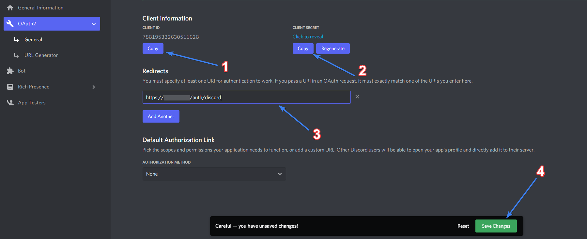

***

:::info What's the purpose ?
Configuring **Cosmo's Discord Synchronization** will allow you and your users to **unlock Discord related achievements**
:::

## Configuring Discord Application

:::warning
If you have trouble understanding how a Discord Application works, please **[read this](https://discord.com/developers/docs)** before going further
:::

**Follow the bellow steps** to create and configure the application to works with Cosmo:
* **go to** [Discord Developer Portal](https://discord.com/developers/applications) and **login if needed**
* **hit the New Application** button and fill the required fields
* in your newly created Application, **go to OAuth2 tab**
* copy the **Client ID** and the **Client Secret** *(you'll need these later)*
* in **Redirects**, add the following URL:
> https://example.com/auth/discord *(replace example.com by your domain)*
* make sure to **Save Changes** once you're done  

Here's a quick illustrated summary of what you should do in OAuth2 tab:

**Once you're done with OAuth2 tab:**
* in your Discord application, **go to Bot tab**
* **create a new bot** and fill required fields
* copy the **token of your bot**

## Configuring Discord Synchronization

:::warning
**Make sure to have the following values** fetched [here](#configuring-discord-application) before continuing: **Client ID** / **Client Secret** / **Bot Token**
:::

Now, **get back to your Cosmo** instance and:
* go to your **Dashboard**
* go in **Settings & Other > Settings > Integrations** tab
* at the bottom of Discord accordion, **enable Discord Sync** and **fill in the three fields** with previously fetched values
> *It's **pretty explicit** at this point, copy your **Application Client ID in Discord Client ID** field, etc..*
* **hit the Save Settings** button and you're good

Here's how it must looks like:  

:::success You're done
If you've done everything perfectly, you should see **Sync Discord button on Cosmo profile** and **authentification should work**
:::