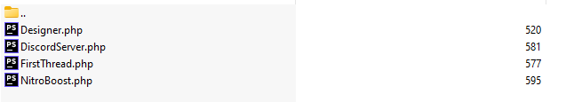

export const Image = ({path}) => (
    
    // Usage example : <Image path="../../static/img/achievement/folder.png"/>
    // Require error : "module not found"
    // Import : not showing the actual image
);

export const Highlight = ({children, color}) => (
  <b style={{ display: 'inline-block', color: color }}> {children} </b>
);

***

## Achievement creation
### Create a new file
To get started, you must **navigate to the** ``app/Achievements/`` folder of your Cosmo installation, this is where all achievements are **defined & stored**.  
  
Once you reach that folder, you can **create a new file** called ``Custom.php`` for example.  
:::info Information
You can put whatever you want for the name as long as it's a **PHP file**.  
Try to use something that **describe what your custom achievement is about**.
:::
  
### File content
**Open** the newly created file ``Custom.php`` & **paste the following code** into it :  
```php
<?php

// Do not touch these
namespace App\Achievements;
use tehwave\Achievements\Achievement;

/**
 * Represents a new achievement
 *
 * @class UniqueName
 */
class Custom extends Achievement
{
    /**
     * Represents the displayed name
     *
     * @var string
     */
    public $name = 'Custom';

    /**
     * Represents the description shown to users
     *
     * @var string
     */
    public $description = 'User has done something special';

    /**
     * Represents the path to the icon of the achievement
     *
     * @var string
     */
    public $icon = 'img/achievements/icon.png';
}
```

:::tip How to edit
It's pretty much **self explained** through the notes, **read carefully**.  
You can edit **these vars** to your likings : <Highlight color="#25c2a0">$name / $description / $icon</Highlight>.  
Make also sure to <Highlight color="#25c2a0">replace the class name</Highlight> *(Custom in the example code)* by whatever you want.
::: 

:::warning
Don't forget to make sure that it **saved your edits properly** when you finished and that the created file **exists** !  
If you <Highlight color="#D33D3D"> get any error at this point</Highlight>, please double-check that you correctly filled your file *(var types, no missing apostrophe, etc..)*.
:::

If you're done, <Highlight color="#25c2a0">your brand new achievement should already appear on Cosmo !</Highlight>

***

## Achievement methods