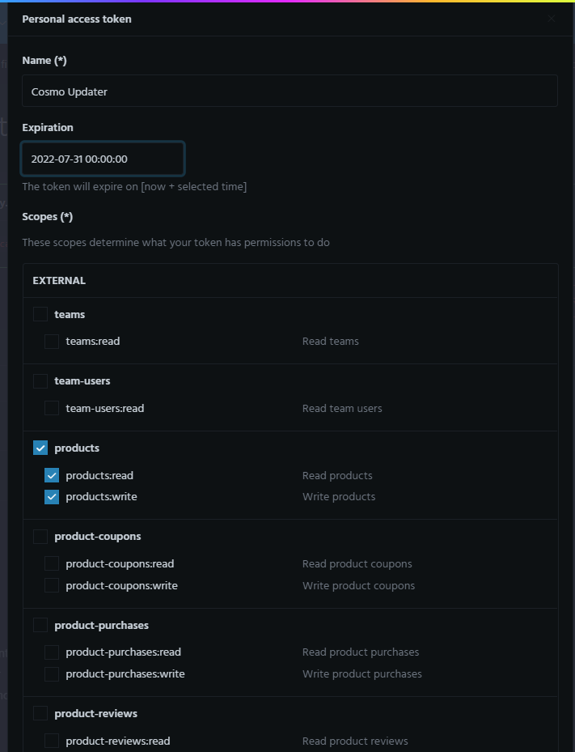
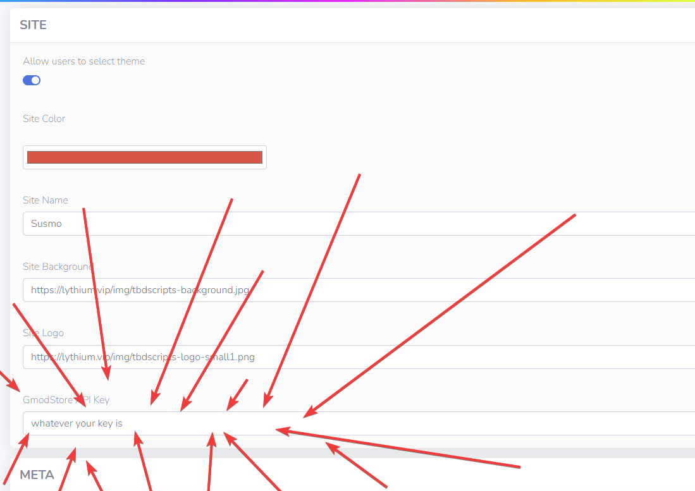

## GmodStore API Key

We will need you to create an API key for Cosmo so we can download the addon and update it automatically for you.

1. Head Over to [https://gmodstore.com](https://gmodstore.com).
2. Navigate to your profiles setting page.

1. Select the "Access Tokens" tab.
2. Select "Generate new token"

3. Check the "Products" and the "Product-Versions" checkbox
4. Copy your access token provided to you

5. Head into your Cosmo management panel and go to settings
6. In the General -> Site section update your GmodStore API key to the one you copied

7. Head over to your management dashboard and you will be able to update your application at the top right of the dashboard.