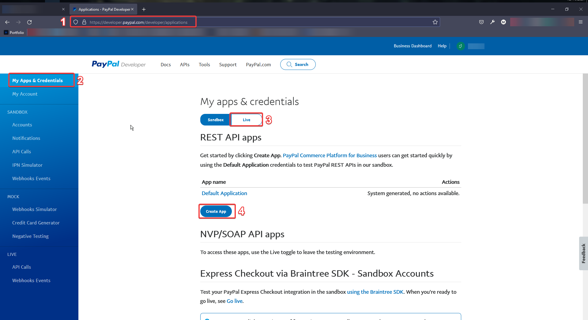
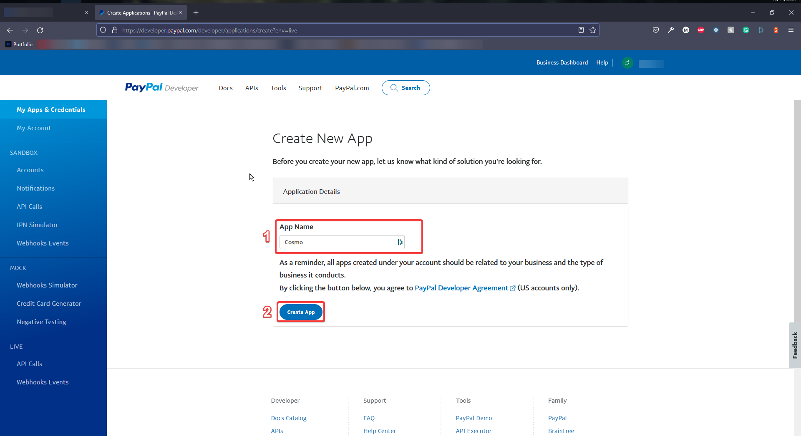
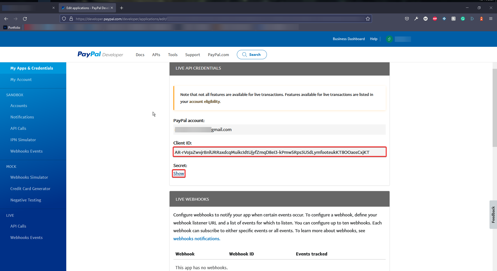
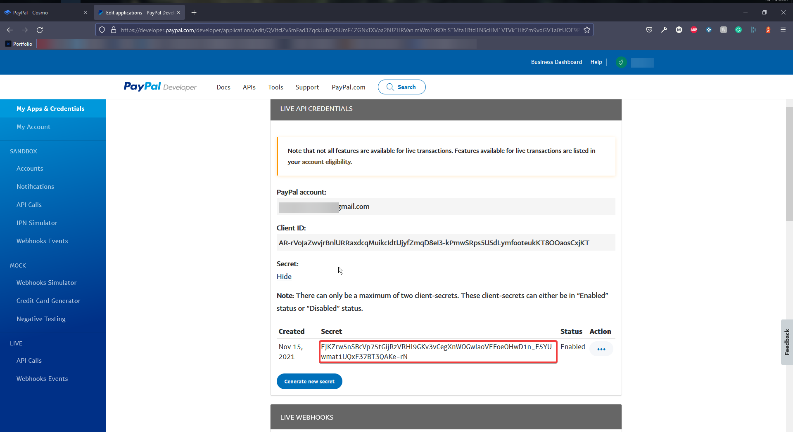
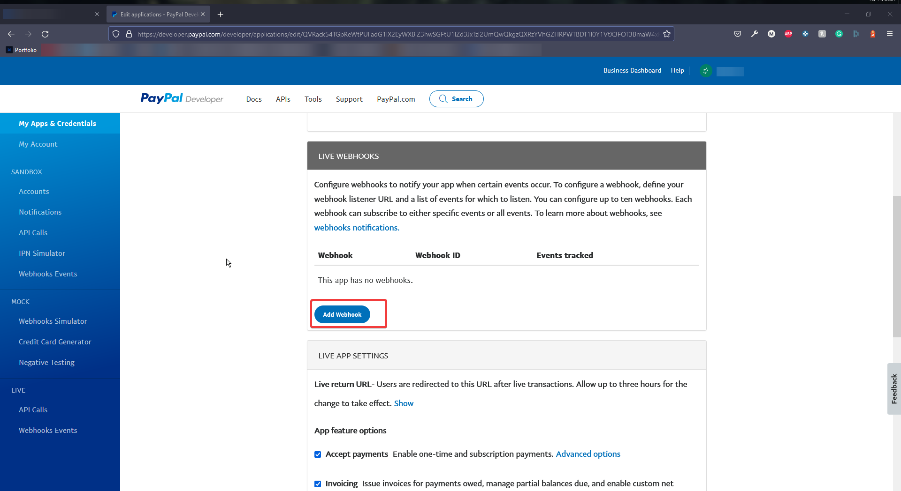
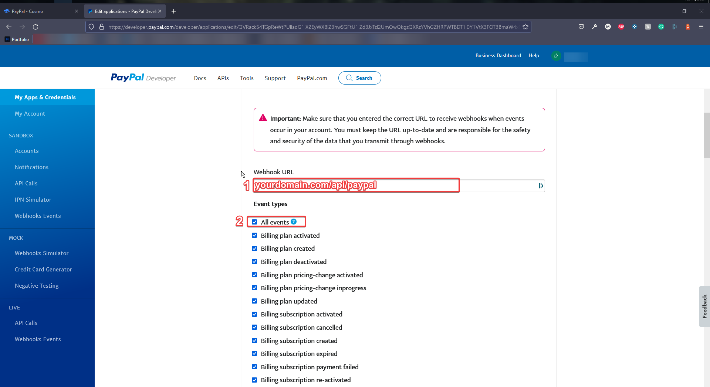
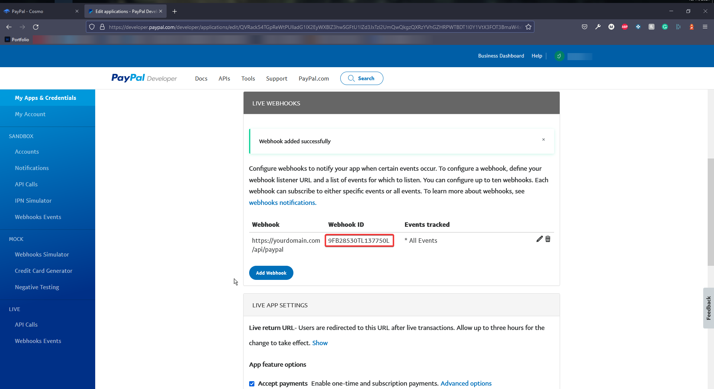
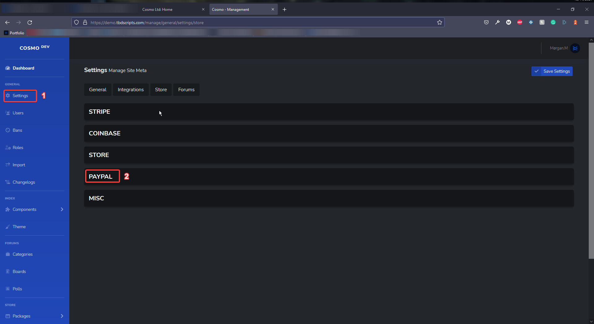
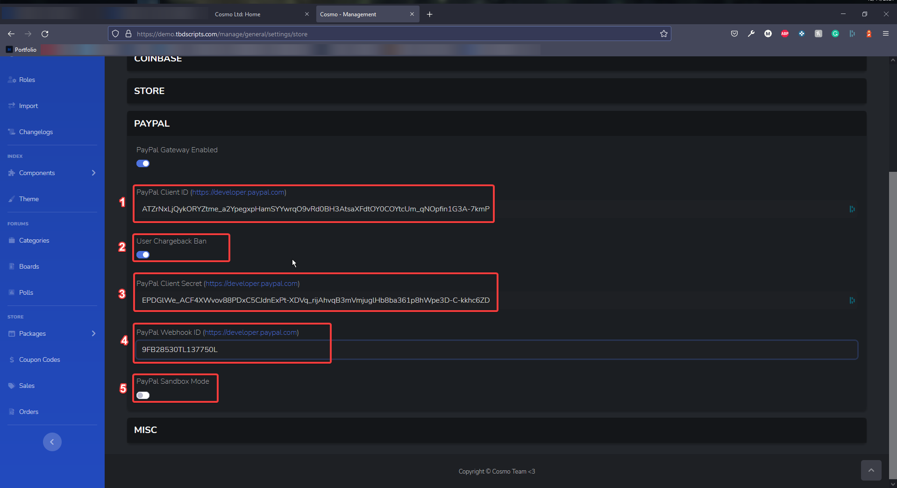

#### PayPal Configuration

1. Head over to [https://developer.paypal.com](https://developer.paypal.com) and sign in with your PayPal account.
2. Navigate to the "My Apps & Credentials" tab
3. Switch the application into "Live" move ("Sandbox" is for **development** purposes **ONLY**)
4. Click "Create App"

1. Name the app something relevant to your website, Cosmo will do fine
2. Click "Create App" once again

1. Open a notepad or notes document.
2. Copy the "Client ID" - Do not share this with anyone
3. Under "Secret" Click show

1. Copy the Client Secret - Do not share this with anyone
2. Scroll down to "Live Webhooks"

Click "Add Webhook"

:::info
Please pay very close attention to the following step, as not following it correctly will lead to issues and or errors.
:::

1. Type your domain followed by "/api/paypal"
2. Check "All Events"
3. Click "Save"

Example: [https://tbdscripts.com](https://tbdscripts.com) - My domain

[https://tbdscripts.com/api/paypal](https://tbdscripts.com/store) - My Webhook URL

1. Copy your Webbook ID.

### Cosmo dashboard configuration

1. Head over to your cosmo admin dashboard
2. Navigate to the "Settings" Tab&#x20;
3. Open the "PayPal" Payment settings

1. Paste your "PayPal Client ID" - Don't share this with anyone
2. "User Chargeback Ban" if a user opens a dispute on your store, They will be banned.
3. Paste your "PayPal Client Secret" - Don't share this with anyone
4. Paste your "PayPal Webhook ID"
5. "PayPal Sandbox Mode" should be disabled by default, In use with Sandbox mode.
